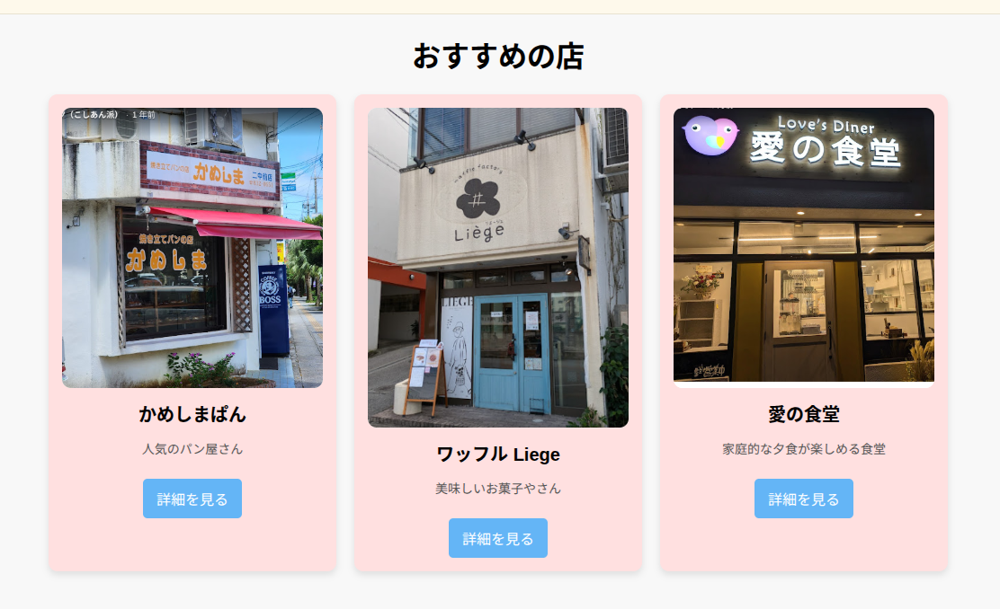
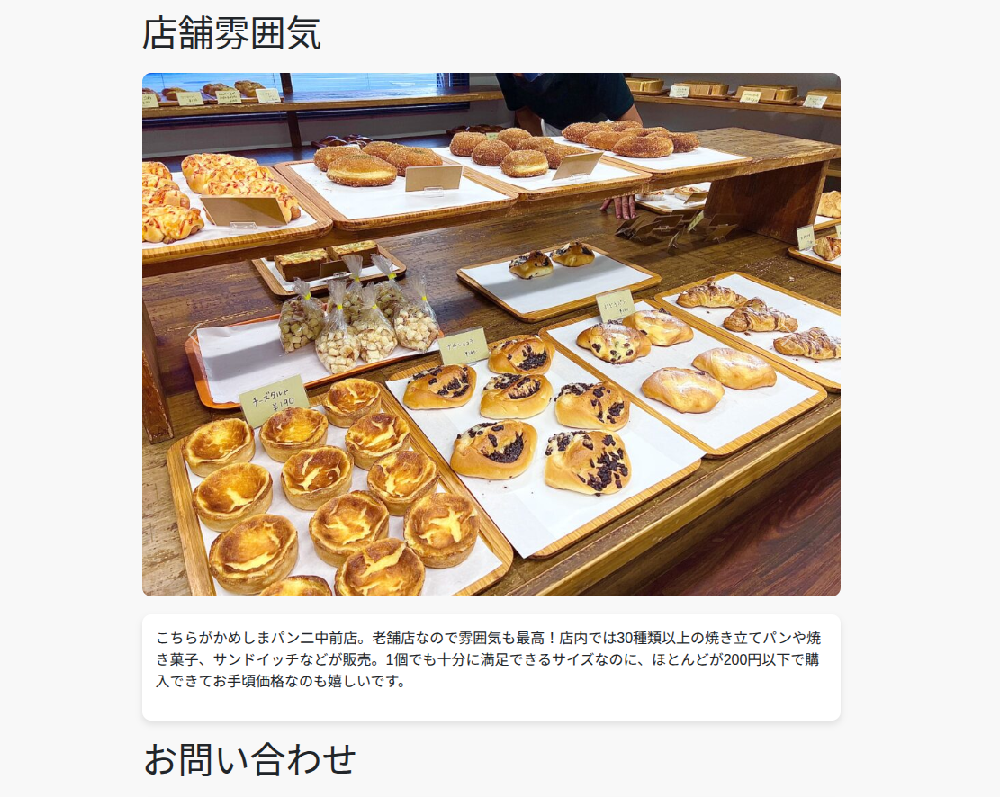
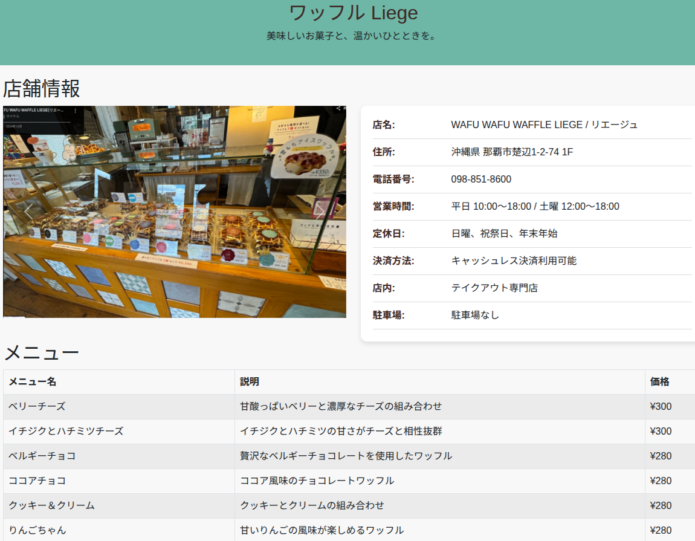
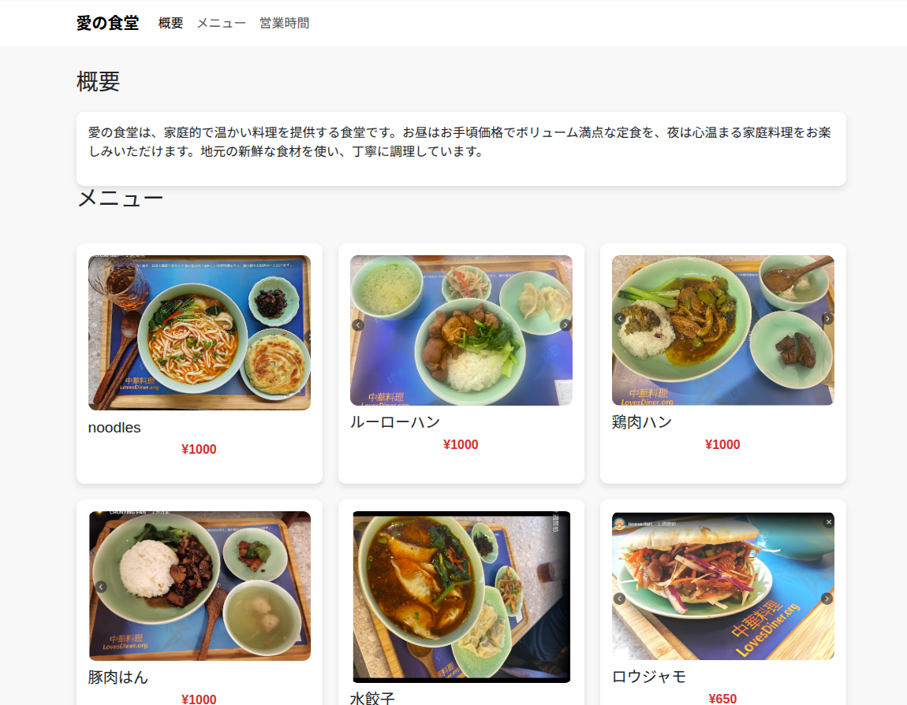

# 🌟 My Recommended Shops Website

「おすすめの店」紹介静的サイトです。  
HTML / CSS / Bootstrap を使って作成しました。  

## 🏙️ サイト概要

おすすめのお店が3店を紹介しますので、トップページと各店舗の詳細ページを４ページで設定、作っています。
それぞれの店舗ページではコンセプト、メニュー、店舗の雰囲気、営業時間などを掲載しています。

## 🕒 開発期間

約 1週間（デザイン構想を含む）

## 💡 工夫した点

- CSS Gridを使って3つの店舗カード（かめしまぱん・ワッフルLiege・愛の食堂）を整ったレイアウト
- 画像カルーセル（Bootstrap Carousel）を活用し、店舗の雰囲気を直感的に伝えるUI を実現
- 「愛の食堂」ページでは、すき家風メニュー表のようなカードレイアウト を作成

## 📷 スクリーンショット

